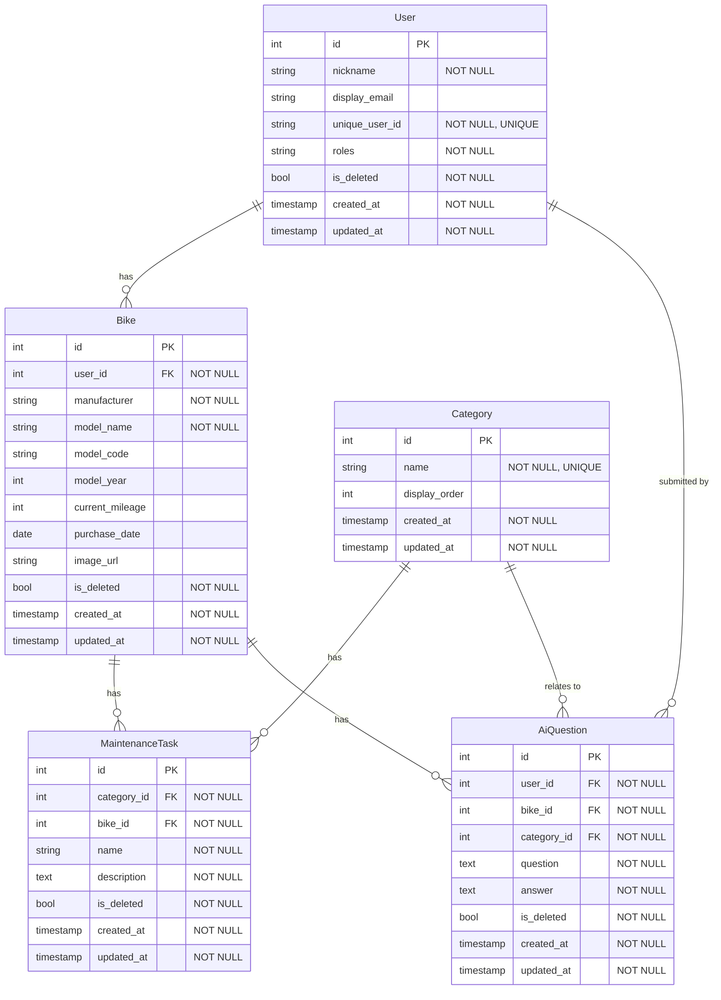
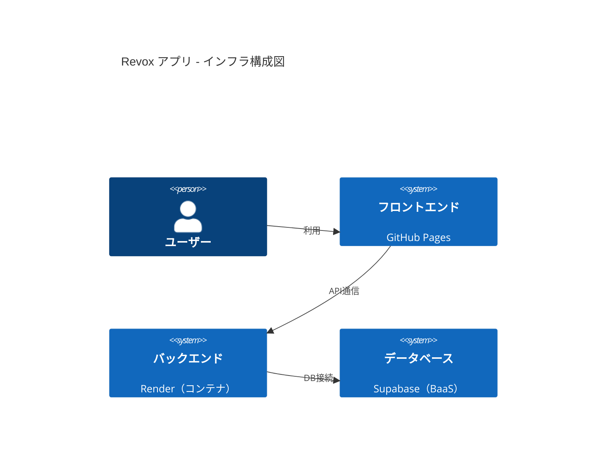

# Revox Backend

## はじめに
このリポジトリは、バイクの整備記録を管理するWebアプリケーションのバックエンドです。
バイクの所有者が、過去の整備履歴や部品情報を手軽に記録・参照できるようにすることを目的に開発しました。

### 制作背景
バイクのメンテナンスは、安全な走行のために不可欠なものですが、「適切な情報はネットにあるのに見つけるのが面倒」、「結局プロに頼めばいいか」といった理由で、自主的な整備を後回しにしてしまうユーザーは少なくありません。  
私自身、バイク整備を趣味とする中で「前回交換した部品を忘れてしまう」といった個人的な課題に加え、特に車名・型式・年式から適合部品を探し出す手間に煩わしさを感じていました。
  
プログラミング学習を通じてAIの便利さを実感し、AIがこの情報収集のハードルを解決する鍵になると考えました。  
ユーザーが手軽に情報を記録・検索できるだけでなく、AIの力を借りることで、自分にとって必要な情報を素早く得られるようにこのアプリケーションを開発しました。  
  
アプリ名「Revox（レボックス）」は、バイクのエンジン音を表す「Rev」と、声や響きを意味する「Vox」を組み合わせた造語です。既存のサービス名と被らない独自性を意識して命名しました。

## 使用技術
  ### バックエンド
  | カテゴリ | 使用技術 |
|----------|-----------|
| 言語     | Java 21 |
| フレームワーク | Spring Boot 3.5.3 |
| セキュリティ | Spring Security |
| ORM      | Spring Data JPA |
| マイグレーション | Flyway |
| データベース | PostgreSQL |
| AI / SDK | Google GenAI |
| コンテナ / 環境構築 | Docker |
| テスト   | JUnit 5 |

  ### フロントエンド
  | カテゴリ | 使用技術 |
|----------|-----------|
| 言語     | TypeScript |
| UIライブラリ | React |  
  
[フロントエンドリポジトリはこちら](https://github.com/rikuto-web/revox_frontend)

  ### インフラ
| カテゴリ | サービス | 
|----------|---------|
| フロントエンド | GitHub Pages |
| バックエンド | Render | 
| データベース | Supabase |
  

## ログイン画面

[ログイン画面](https://rikuto-web.github.io/revox_frontend)  
Google認証、ゲストログインがあります。  
*ゲストログインは閲覧のみ可能で、登録・更新・削除・AIへの質問はできません
  

## APIエンドポイント一覧
[API仕様書はこちら](https://rikuto-web.github.io/revox/)
### 外部認証に関する管理

| HTTPメソッド | エンドポイント | 機能名 |
|--------------|----------------|--------|
| GET  | /api/auth/ping   | サーバーのウォームアップ |
| POST | /api/auth/guest  | ゲストユーザーとしてログインする |
| POST | /api/auth/google | Google認証でログインする |

---

### ユーザー情報に関する管理

| HTTPメソッド | エンドポイント | 機能名 |
|--------------|----------------|--------|
| PATCH | /api/users/{userId}              | ユーザー情報を更新する |
| PATCH | /api/users/{userId}/softDelete   | ユーザーを論理削除する |

---

### バイク情報に関する管理

| HTTPメソッド | エンドポイント | 機能名 |
|--------------|----------------|--------|
| GET   | /api/bikes/user/{userId}                      | ユーザーのバイク情報リストを取得する |
| POST  | /api/bikes/user/{userId}                      | バイク情報を新規登録する |
| GET   | /api/bikes/user/{userId}/bike/{bikeId}        | 特定のバイク情報を取得する |
| PATCH | /api/bikes/user/{userId}/bike/{bikeId}        | バイク情報を更新する |
| PATCH | /api/bikes/user/{userId}/bike/{bikeId}/softDelete | バイク情報を論理削除する |

---

### 整備タスクに関する管理

| HTTPメソッド | エンドポイント | 機能名 |
|--------------|----------------|--------|
| POST  | /api/maintenance-task | 整備タスクを新規登録する |
| PATCH | /api/maintenance-task/{maintenanceTaskId}            | 整備タスクを更新する |
| PATCH | /api/maintenance-task/{maintenanceTaskId}/softDelete | 整備タスクを論理削除する |
| GET   | /api/maintenance-task/user/{userId}                  | ユーザーの最新整備タスクリストを取得する |
| GET   | /api/maintenance-task/bike/{bikeId}                  | 特定のバイクの全整備タスクを取得する |
| GET   | /api/maintenance-task/bike/{bikeId}/category/{categoryId} | バイクとカテゴリーで整備タスクを取得する |

---

### AIに関する管理

| HTTPメソッド | エンドポイント | 機能名 |
|--------------|----------------|--------|
| POST | /api/ai/user/{userId}/bike/{bikeId}/category/{categoryId} | AIに質問を送信する |
| GET  | /api/ai/user/{userId}                                    | AI質問履歴を取得する |

---

### カテゴリーに関する管理

| HTTPメソッド | エンドポイント | 機能名 |
|--------------|----------------|--------|
| GET | /api/categories | 全カテゴリー情報を取得する |

---
ER図
---

## インフラ構成図

## テスト結果

  

## 技術的な挑戦と学び
### 1. 自主的な技術選定と導入
学習段階ではMyBatisとMySQLを用いた演習が中心でしたが、実務での利用状況やSpring Bootとの親和性を調査した上で、JPAとFlywayを自主的に導入しました。

MyBatisのXMLベースのSQL記述に比べ、JPAではアノテーションベースで直感的にエンティティやリレーションを定義でき、コードの可読性や保守性が向上します。  
また、JPAはSpring Bootで標準サポートされており、現場での採用例が多いため、実務で役立つ技術と判断しました。
  
今回のプロジェクトでは、Flywayと併用したためddl-auto の update 機能は使用せず、マイグレーションスクリプトでSQLを管理しました。
validate に変更することで、エンティティ定義とスクリプトの差分をチェックし、安全にスキーマ管理が行える設計としています。
  
Docker
開発環境をコンテナ化し、環境依存の不具合を回避。再現性の高い環境構築の効率性と重要性を実感しました。

### AI機能の実装（整備アドバイス機能）
本アプリでは、ユーザーが保有するバイク情報をもとに、AIが質問に対して回答する機能を実装しました。
#### **機能概要**
1. ユーザーがバイクのメーカー・名前・型式・年式を登録
2. AIに質問を入力（例：オイル交換がしたい・適合バッテリーを教えて）
3. AIが登録情報を参照し、選択したバイクに合わせた適合情報を生成して回答  
   (ナットサイズ〇mm　適合オイル粘度〇W-〇などを含めた内容)
4. この仕組みにより、ユーザーは自分の保有する特定のバイクに対して、部品の適合や整備のヒントを手軽に得られます

AI機能の実装では、SDKのバージョン違いや認証エラーなどのAPI連携の課題に直面しました。  
AIの回答は信憑性にばらつきがあったため、公式ドキュメントやGitHubのREADMEを参照して情報を補完し、試行錯誤を繰り返すことで解決しました。  
  
また、サービスの安全性を考慮し、アプリケーション側で5回/分・30回/日のリクエスト制限を独自に実装しました。  
この経験を通じ、AIツールの限界を理解しつつ、信頼できる情報源を主体的に活用する力や、現場に即した情報を取得するUX設計の重要性を学びました。

### 3. コストを意識したデプロイ
ポートフォリオとして提出後も開発を継続することを前提に、運用コストを抑えるため無料枠のあるRenderとSupabaseの利用を選択しました。  
  
この構成への変更に伴い、MySQLからPostgreSQLへの移行や、RenderとSDKの環境変数の処理方法の違いといった課題に直面し、様々な方法で検証し、コード内で明示的に処理することで問題を解決しました。  

## 今後の開発計画
### 短期目標
- AI回答履歴の物理削除機能の実装
- バイク情報の論理削除済み情報の検索機能（以前所有していたバイクとして）  

### 中期目標
- バイク画像の登録・更新・削除機能の実装
- AIプロンプトの最適化・回答生成速度の改善
- ダッシュボードに最終整備日時から次回整備予定日時を表示

### 長期目標
- 可読・堅牢性のある安全なコードにリファクタリング、Spring Securityの理解
- パフォーマンスの改善
- テストカバレッジの改善

## 製作期間
2025年7月～8月
制作時間　220時間

## リンク
デプロイ版：https://rikuto-web.github.io/revox_frontend  
フロントエンドリポジトリ：https://github.com/rikuto-web/revox_frontend  
API仕様書：https://rikuto-web.github.io/revox/
